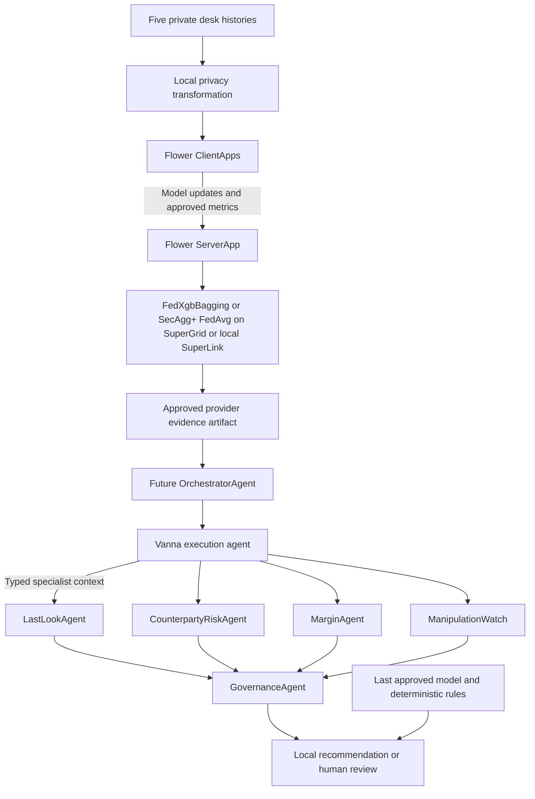

# Vanna Technical Architecture

## Purpose

Vanna provides federated FX execution intelligence without centralising raw
desk data or placing Flower network latency in the live routing path.

## System topology



The future orchestrator is intentionally the final integration layer. Agent
development can proceed independently against the artifact and handoff
contracts described below.

## Flower applications

### Federation FAB

Location: `apps/federation`

- `ClientApp` loads one of five reproducible private desk partitions.
- Default mode: clients train local XGBoost trees (FedXgbBagging) and return
  model bytes, aggregate metrics, and `raw-records-shared: 0`.
- Secure mode (`--run-config secure-aggregation=true`): clients train the
  transparent NumPy logistic fill-probability model, and the conditional
  `secaggplus_mod` masks every update under Flower's SecAgg+ protocol. The
  server only recovers the weighted average across desks (FedAvg);
  individual desk updates are never visible to the server. SecAgg+ is a
  summation protocol, so it cannot merge XGBoost trees — the two modes are
  therefore distinct by construction.
- `ServerApp` runs three rounds across five SuperNodes in both modes and
  exports approved aggregate evidence to
  `artifacts/generated/provider_evidence.json` with an identical schema.

Secure-mode parameters: `num-shares=5`, `reconstruction-threshold=3`
(tolerates up to two node dropouts per round), `max-weight=1000`,
`secagg-timeout=60`, `local-epochs=8`, `learning-rate=0.15`. Per-round
checkpoints in secure mode contain only the reconstructed aggregate.

### Agent FAB

Location: `apps/agent`

- Accepts a strict JSON order through `agent.input`.
- Loads only approved provider evidence.
- Provides six independently testable roles:
  - Vanna ranks providers by expected executable value.
  - LastLookAgent evaluates conditional rejection asymmetry.
  - CounterpartyRiskAgent calculates explainable provider reliability.
  - MarginAgent assesses margin, leverage, and settlement pressure.
  - ManipulationWatch detects market-pattern anomalies for review.
  - GovernanceAgent applies privacy, collusion, freshness, and oversight rules.
- Computes every numerical assessment and governance action deterministically.
- The current runtime entry point retains the bounded Vanna → LastLook demo
  chain until the final orchestrator is merged.
- Persists compact structured state in Flower `Context`.
- Falls back to a deterministic answer if the model endpoint fails.

The FABs remain separate because Flower does not allow an `agentapp` component
in the same bundle as `serverapp` and `clientapp` components.

### Demo dashboard

Location: `apps/dashboard`

- A standalone React/Vite terminal pairs with a localhost-only Python gateway
  (`vanna_agent.gateway`) for the 3–5 minute demo.
- The gateway accepts only the strict, bucketed `OrderRequest`, retrieves a
  public Alpha Vantage quote with an explicit local fallback, and invokes the
  deterministic AgentApp domain path against approved evidence.
- The terminal can create a local `PENDING_HUMAN_APPROVAL` audit record only.
  It cannot send broker/OMS orders, automatically execute, blacklist, or
  coordinate providers.
- A SuperLink or SuperGrid AgentApp run remains a separate Flower runtime
  demonstration. The terminal labels this separation instead of claiming a
  direct browser-to-SuperLink control path.

## Runtime targets

- Local simulation: managed local SuperLink with five simulated SuperNodes.
- Local AgentApp: local SuperLink configured with an Open Responses-compatible
  model endpoint.
- Remote: SuperGrid federation `@molyleela/Vanna`.

Runtime credentials and the selected federation belong in local Flower
configuration or environment variables, never in the repository.

## Contracts

### Order input

```json
{
  "pair": "EUR/USD",
  "side": "BUY",
  "size_bucket": "1m-5m",
  "volatility": "high",
  "available_providers": ["LP_A", "LP_B", "LP_C"]
}
```

### Federation-to-agent artifact

The artifact contains:

- Cohort size and explicit privacy counters.
- Provider sample count and predicted fill/rejection probabilities.
- Expected slippage and latency.
- Displayed-price benefit and conditional rejection asymmetry.
- Model version and generation timestamp.

It must not contain raw identities, order IDs, UTIs, exact live notionals,
positions, or live trading intentions.

### Agent handoffs

Vanna passes only order buckets, selected provider, expected executable cost,
fill probability, confidence, model version, and freshness. The specialist
agents add bounded assessments:

- LastLookAgent: conditional rejection-asymmetry signal.
- CounterpartyRiskAgent: reliability score and route posture.
- MarginAgent: pressure level, size multiplier, and human-review requirement.
- ManipulationWatch: anomaly score and surveillance review signal.

GovernanceAgent consumes these typed outputs and returns one of:

- `ALLOW_LOCAL_RECOMMENDATION`
- `REDUCE_SIZE`
- `USE_LOCAL_FALLBACK`
- `HUMAN_REVIEW`
- `SUPPRESS_COLLECTIVE_OUTPUT`

All outcomes prohibit automatic execution and automatic blacklisting.

## Operational flow

1. Run the federation in the background.
2. Export and sync the approved evidence artifact.
3. Keep the artifact/model cached locally.
4. Run the AgentApp or deterministic local path for an order.
5. Preserve model version, evidence, recommendation, governance, and override
   state for audit.

## Verification

```bash
uv run pytest -q
(cd apps/federation && uv run flwr build)
(cd apps/agent && uv run flwr build)
uv run python scripts/local_demo.py
# Secure aggregation mode (local simulation):
(cd apps/federation && uv run flwr run . --federation-config="num-supernodes=5" \
  --run-config "secure-aggregation=true" --stream)
```
